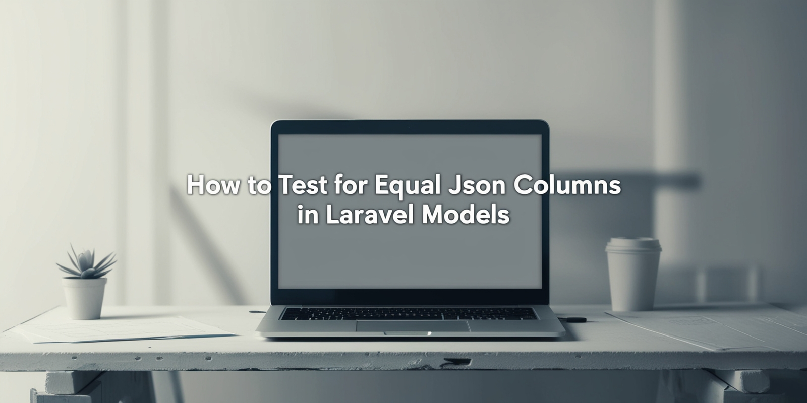

# How to Test for Equal JSON Columns in Laravel Models



When testing models with JSON columns, direct string comparisons can fail because JSON is stored as text in the database - small encoding differences (like key order or spaces) make two equal JSONs appear different.

## Example

```php
$this->assertDatabaseHas(PriceSchedule::class, [
    'weekday' => ['mon', 'tue'],
]);
````

This may fail even if the data matches logically.

## Fix: Use `$this->castAsJson()`

```php
$this->assertDatabaseHas(PriceSchedule::class, [
    'weekday' => $this->castAsJson(['mon', 'tue']),
]);
```

`castAsJson()` ensures both the expected and stored JSON are compared consistently.

## Why It Matters

* JSON data is saved as strings in SQL
* Minor formatting differences can break tests
* `$this->castAsJson()` makes your tests stable and predictable

---

**TL;DR:** Always wrap JSON columns with `$this->castAsJson()` in database assertions.

📎 [Read the full article](https://dev.to/tegos/how-to-test-for-equal-json-columns-in-laravel-models-24e)
